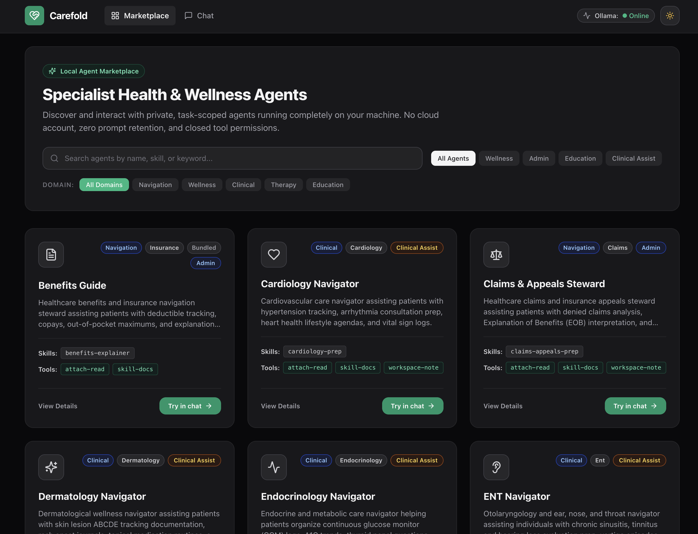
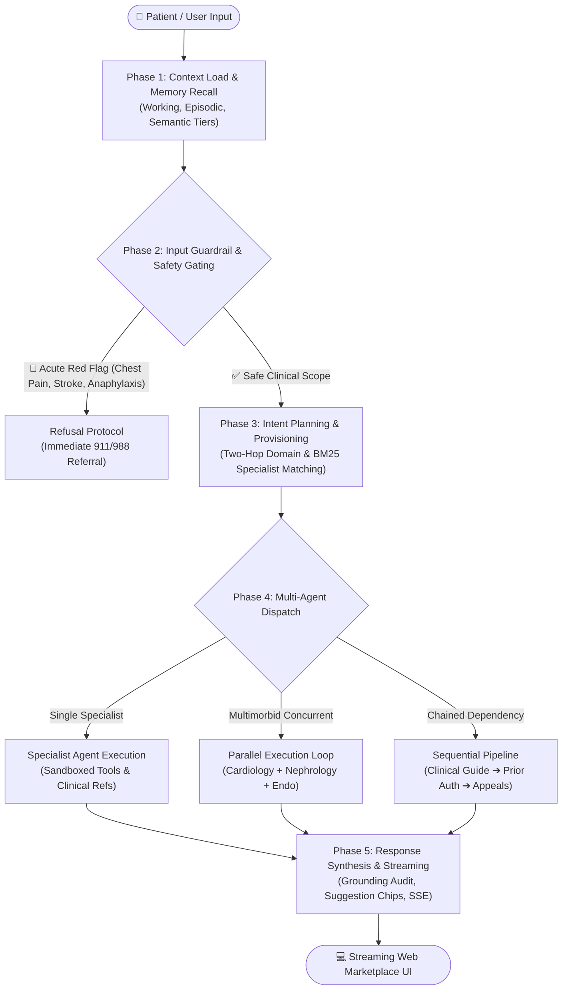

<!--
  Carefold — Healthcare AI Agent Marketplace & Runtime
  Copyright 2026 Spectrayan

  Licensed under the Apache License, Version 2.0 (the "License");
  you may not use this file except in compliance with the License.
  You may obtain a copy of the License at

      http://www.apache.org/licenses/LICENSE-2.0

  Unless required by applicable law or agreed to in writing, software
  distributed under the License is distributed on an "AS IS" BASIS,
  WITHOUT WARRANTIES OR CONDITIONS OF ANY KIND, either express or implied.
  See the License for the specific language governing permissions and
  limitations under the License.
-->

<h1 align="center">Carefold</h1>

<p align="center">
  <strong>Privacy-Preserving Healthcare AI Agent Marketplace & Runtime.</strong>
</p>

<p align="center">
  <a href="LICENSE"></a>
  <a href="https://www.python.org/"></a>
  <a href="https://nodejs.org/"></a>
  <a href="https://nextjs.org/"></a>
  <a href="https://fastapi.tiangolo.com/"></a>
  <a href="https://github.com/spectrayan/carefold/pkgs/container/carefold"></a>
  <a href="https://github.com/spectrayan/carefold/actions"></a>
  <a href="https://spectrayan.github.io/carefold/"></a>
</p>

<p align="center">
  <em>"Healthcare AI cannot be a black box or a centralized data honeypot. It must be local-first, structurally safe, grounded in clinical reality, and strictly accountable to human stewards."</em>
</p>

---

**Carefold** is an open-source, local-first healthcare AI agent marketplace and multi-agent execution runtime. Designed for clinical visit preparation, health insurance navigation, and chronic care support, Carefold runs entirely on user-controlled hardware (or private self-hosted endpoints) to safeguard patient privacy.

It pairs a **5-phase LangGraph orchestration engine** with **22 specialist clinical and administrative navigators**, modular skill packs, hexagonal memory architecture (ready for Spector cognitive memory), zero-trust sandboxed tools, and a two-tier clinical safety guardrail system.

<details>
  <summary>📸 <strong>Preview Carefold Web Marketplace UI</strong> (Click to expand)</summary>
  <br />
  <p align="center">
    
  </p>
</details>

---

## ⚡ 30-Second Quickstart

Get a local Carefold runtime and agent marketplace running in seconds:

### 1. Instant Launch via Docker Compose
```bash
# Start FastAPI backend (:8000) and Next.js marketplace UI (:3000)
docker compose up -d

# Or include local Ollama for 100% offline local LLM inference:
docker compose --profile embeddings up -d
```
Visit `http://localhost:3000` to browse specialist agents and launch private consultations.

### 2. Local Monorepo Development

**Prerequisites**: Python 3.12+, Node.js 22 LTS, and `pnpm` (>=9.0.0).

```bash
# Clone repository
git clone https://github.com/spectrayan/carefold.git
cd carefold

# Install frontend dependencies
pnpm install

# Set up backend environment
python3 -m venv backend/.venv
source backend/.venv/bin/activate
pip install -e backend
pip install -r backend/requirements-dev.txt

# Start backend server (Terminal 1)
uvicorn carefold.api.main:app --host 127.0.0.1 --port 8000 --reload

# Start Next.js marketplace UI (Terminal 2)
pnpm --filter web dev
```

---

## 🤖 5-Phase Multi-Agent LangGraph Lifecycle

Carefold executes multi-agent workflows across a deterministic 5-phase lifecycle:



1. **Phase 1: Context Load & Memory Recall (`InputGuardrailNode`)**:
   - Ingests user query, conversation history, user notes, and document attachments.
   - Recalls semantic and episodic memories via `MemoryPort`.
2. **Phase 2: Input Guardrail & Validation (`InputGuardrailNode`, `RefusalNode`)**:
   - Intercepts acute life-threatening emergencies with immediate emergency directives.
   - Gently steers users on non-clinical boundaries without hard rejection.
3. **Phase 3: Plan & Provision (`OrchestratorNode`)**:
   - **Two-Hop Routing**: Hop 1 classifies clinical domain; Hop 2 performs BM25 full-text matching against specialist manifests.
   - Dynamically provisions authorized clinical skill checklists and reference documentation.
4. **Phase 4: Specialist Agent Execution (`AgentExecutionNode`, `ToolNode`)**:
   - Invokes domain specialist personas with strictly sandboxed tools (`attach-read`, `workspace-note`, `skill-docs`).
   - Supports single agents, parallel fan-out for multimorbid queries, and chained sequential pipelines.
5. **Phase 5: Response Synthesis & Guardrails (`ResponseSynthesizerNode`, `SuggestionNode`)**:
   - Verifies grounding and persona purity.
   - Emits Server-Sent Events (SSE) streaming tokens, tool call traces, and dynamic follow-up chips.

---

## 🏥 Specialist Agent Topology

Carefold includes 22 specialist clinical/navigational agents and 6 internal system infrastructure agents:

| Agent Identifier | Domain | Category | Risk Class | Clinical Scope & Capabilities |
|---|---|---|---|---|
| `cardiology-guide` | `clinical` | `cardiology` | `clinical_assist` | Heart health, hypertension logs, arrhythmia visit agendas, chest pain warnings |
| `pulmonology-guide` | `clinical` | `pulmonology` | `clinical_assist` | Asthma & COPD action plans, dyspnea tracking, inhaler adherence reviews |
| `neurology-guide` | `clinical` | `neurology` | `clinical_assist` | Migraine & headache logs, cognitive symptom tracking, neurological visit agendas |
| `gastro-guide` | `clinical` | `gastroenterology` | `clinical_assist` | IBS/IBD food trigger journals, colonoscopy & endoscopy preparation |
| `nephrology-guide` | `clinical` | `nephrology` | `clinical_assist` | Kidney health, eGFR/creatinine lab review prep, renal fluid & sodium logs |
| `endocrinology-guide` | `clinical` | `endocrinology` | `clinical_assist` | Diabetes CGM logs, A1C tracking, thyroid disorder visit preparation |
| `derma-guide` | `clinical` | `dermatology` | `clinical_assist` | Lesion ABCDE tracking guide, rash documentation, topical adherence |
| `ortho-guide` | `clinical` | `orthopedics` | `clinical_assist` | Joint pain scales, mobility tracking, physical therapy and surgery consultation prep |
| `oncology-navigator` | `clinical` | `oncology` | `clinical_assist` | Treatment navigation, chemotherapy side-effect logs, tumor board agendas |
| `rheuma-guide` | `clinical` | `rheumatology` | `clinical_assist` | Autoimmune flare-up trackers, morning stiffness logs, biologic monitoring |
| `urology-guide` | `clinical` | `urology` | `clinical_assist` | Bladder health, frequency-volume tracking, prostate consultation prep |
| `eye-guide` | `clinical` | `ophthalmology` | `clinical_assist` | Vision changes, glaucoma & macular degeneration monitoring, surgery prep |
| `ent-guide` | `clinical` | `ent` | `clinical_assist` | Sinusitis tracking, tinnitus diaries, audiogram & hearing consultation prep |
| `visit-steward` | `clinical` | `general` | `clinical_assist` | General primary care preparation, doctor agendas, medication reconciliations |
| `benefits-guide` | `navigation` | `insurance` | `admin` | EOB breakdown, deductible/copay tracking, insurance policy explainer |
| `claims-appeals-guide`| `navigation`| `appeals` | `admin` | Denied claim analysis, ERISA appeal timelines, external review drafting |
| `prior-auth-navigator`| `navigation`| `authorizations` | `admin` | Prior authorization criteria, step therapy documentation, physician checklists |
| `formulary-guide` | `navigation` | `pharmacy` | `admin` | Drug tiers, generic bioequivalent substitutions, copay assistance discovery |
| `records-coordinator` | `navigation` | `records` | `admin` | Multi-provider medical records organization, lab dossiers, HIPAA requests |
| `habit-companion` | `wellness` | `habits` | `wellness` | Daily hydration, sleep routines, medication reminder checklists |

### System Infrastructure Agents (`agents/_system`)
* **`orchestrator`**: Two-hop intent classification, dynamic skill provisioning, and multi-topology dispatch.
* **`document-extractor`**: Ingestion sandbox, PII sanitization, structured Pydantic extraction, and numerical grounding validation.
* **`quality-reviewer`**: Clinical safety boundary audit, tone inspection, and persona alignment verification.
* **`triage-auditor`**: Compliance logging, risk tagging, and clinical safety telemetry.
* **`skill-generator`**: Synthesis of dynamic skill manifests and validation templates from clinical guidelines.
* **`suggestion-generator`**: Context-aware follow-up suggestion chips presented in the client UI.

---

## 🧠 Cognitive Memory & Spector Integration

Carefold implements a hexagonal architecture for memory and agent discovery:

* **`MemoryPort`**: Cognitive memory interface supporting working, episodic, semantic, and procedural memory tiers with salience ranking and decay.
* **`CatalogPort`**: Full-text and BM25 agent/skill catalog search index.
* **Zero-Dependency SQLite FTS5 Adapter**: Out-of-the-box local storage requiring no external services.
* **Spector-Ready**: Seamlessly connects to [Spector](https://github.com/spectrayan/spector) — Spectrayan's SIMD-accelerated cognitive memory engine — via a single configuration flag (`MEMORY_BACKEND=spector`).

---

## 🛡️ Two-Tier Clinical Safety & Sandboxed Security

Carefold enforces strict safety invariants to ensure patient safety and privacy:

### 1. Two-Tier Clinical Boundary System
* **Tier 1 (Emergency Red Flags)**: Instant termination with 911/988 emergency escalation when acute symptoms are detected (e.g. crushing chest pain radiating to the jaw, acute stroke FAST symptoms, anaphylaxis, severe respiratory distress).
* **Tier 2 (Soft Boundary Steering)**: Constructive educational redirection for non-emergent requests for formal diagnoses or dosage calculations.

### 2. Zero-Trust Sandboxed File Security
* **Path Traversal Shield**: Strict lexical normalization and containment checks preventing `../` traversal, null bytes, and protocol escaping across `attachments/` and `workspace/notes/`.
* **Symlink Neutralization**: Automatic detection and rejection of symlinks pointing outside the workspace sandbox.
* **Grounding Validation**: Validates all extracted numerical lab values, copays, and deductibles against raw source documents.
* **47-Attack Penetration Test Suite**: Automated penetration testing covering path traversal, command injection, symlink overwrites, and unauthenticated skill access.

---

## 🚀 Quality Gates & Verification Matrix

Carefold maintains rigorous verification standards across all code changes:

```bash
# 1. Spectrayan Apache-2.0 License Header Check
pnpm run check:licenses

# 2. Backend Pytest Suite (3,900+ tests)
backend/.venv/bin/pytest backend/tests/

# 3. Security Penetration Suite (47 Attack Vectors)
PYTHONPATH=backend/src backend/.venv/bin/python backend/tests/penetration_suite.py

# 4. Frontend Typecheck
pnpm --filter web typecheck

# 5. Frontend Unit & Component Tests
pnpm --filter web test --exclude "**/api/**"

# 6. Frontend Production Build
pnpm --filter web build
```

---

## 📜 Architecture Decision Records (ADRs)

Carefold uses a living ADR framework to document architectural decisions:
* [ADR 0001: Orchestrator-Driven Agent Architecture](docs/adr/0001-orchestrator-driven-agent-architecture.md)
* [ADR 0002: Hexagonal Memory and Catalog Ports](docs/adr/0002-hexagonal-memory-and-catalog-ports.md)

---

## 📄 License & Attribution

Carefold is licensed under the **Apache License 2.0**. See the [LICENSE](LICENSE) and [NOTICE](NOTICE) files for details.

Copyright © 2026 Spectrayan.
