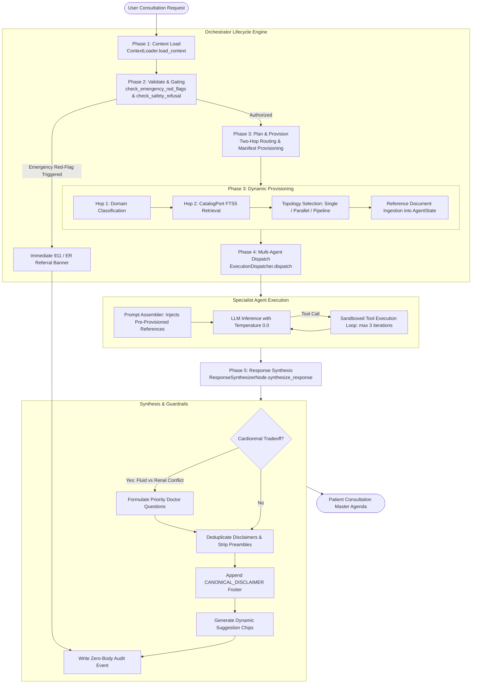
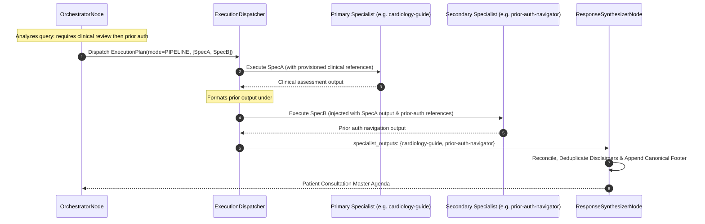

# ADR-0001: Orchestrator-Driven Multi-Agent Architecture

## Metadata

| Property | Value |
|---|---|
| **Status** | `Accepted (Implemented)` |
| **Date** | 2026-10-02 |
| **Authors** | Spectrayan Architecture Team (`architecture@spectrayan.com`) |
| **Deciders** | Carefold Core Maintainers, Clinical AI Reviewers |
| **Consulted** | Medical Informatics Lead, Security Engineering Team |
| **Informed** | Carefold Open-Source Community |

---

## Context & Problem Statement

In early iterations of the Carefold runtime, agent execution suffered from severe architectural coupling and persona contamination:
1. **Persona Contamination**: Specialist agent personas (`persona.md`) contained hardcoded operational plumbing—including specific tool IDs (`skill_id="cardiology-prep"`), exact document filenames (`hypertension_log_template.md`), and filesystem invocation instructions.
2. **Hardcoded Specialty Dispatching**: The central routing node contained fragile Python `if/elif` branching statements (e.g., `elif "cardiology-prep" in agent_skill_ids: req_docs.append(...)`), which failed to scale beyond a handful of agents.
3. **Unfed Provisioned Context**: Even when reference documents were identified, their content was not injected into the specialist agent's prompt context, forcing agents to make redundant tool calls to read documents the orchestrator already knew were required.
4. **Lack of Central Synthesis**: Multi-agent consultations (such as multimorbid cardiology and nephrology cases) produced fragmented, disconnected responses with competing disclaimers and conflicting medical guidance (e.g. fluid restriction vs. renal clearance).

Carefold required a scalable, modular architecture capable of orchestrating 20+ specialized clinical navigators and administrative stewards while preserving clinical persona purity and deterministic safety.

---

## Decision Drivers

- **Persona Purity**: Specialist agents must define domain focus, bedside empathy, and interview protocols without knowledge of filesystem paths or tool mechanics.
- **Dynamic Catalog-Driven Provisioning**: Reference resolution must be driven entirely by manifests (`agent.yaml` and `carefold.yaml`) without hardcoded Python branching.
- **Multi-Topology Execution**: Support fast single-agent queries, parallel fan-out for multimorbid symptoms, and sequential pipeline execution for cross-functional workflows.
- **Cardiorenal Conflict Reconciliation**: Automatically reconcile competing organ recommendations into collaborative doctor-discussion questions.
- **Deterministic Safety & Auditability**: Pre-emptive emergency red-flag gating and immutable zero-body audit logging.

---

## Considered Options

### Option 1: Hardcoded Specialty Dispatch in Orchestrator
* **Description**: Continue maintaining conditional `if/elif` branches in `OrchestratorNode` for each medical specialty.
* **Pros**: Simple to write for 2–3 initial agents.
* **Cons**: Unmaintainable across 22+ specialist agents and 23 skill packs; causes prompt divergence; tightly couples orchestrator to specific skill filenames.

### Option 2: Decentralized Peer-to-Peer Agent Handoffs
* **Description**: Allow agents to call `delegate_to_agent` directly to transfer control to peer specialists in an autonomous agent mesh.
* **Pros**: Highly dynamic agent-to-agent collaboration.
* **Cons**: High risk of infinite delegation loops; difficult to enforce centralized clinical safety gating; impossible to perform coherent post-hoc response synthesis; significant latency and token overhead.

### Option 3: Unified Orchestrator-Driven 5-Phase Lifecycle (Selected)
* **Description**: Centralize routing, gating, dynamic provisioning, dispatching, and response synthesis into an explicit 5-phase lifecycle:
  $$\text{Context Load} \longrightarrow \text{Validate and Gate} \longrightarrow \text{Plan and Provision} \longrightarrow \text{Dispatch} \longrightarrow \text{Synthesize}$$
* **Pros**:
  - Enforces 100% Persona Purity across all 22 agents.
  - Dynamically provisions reference documents directly into prompt context.
  - Supports Single, Parallel, and Pipeline execution topologies.
  - Reconciles cardiorenal tradeoffs and dedupes disclaimers at synthesis time.
  - Centralizes emergency red-flag circuit breakers.
* **Cons**: Slightly higher architectural complexity in the orchestrator node.

---

## Decision Outcome

**Chosen Option**: **Option 3: Unified Orchestrator-Driven 5-Phase Lifecycle**

We established the orchestrator as the central conductor of all multi-agent interactions.

### High-Level Architecture Diagram

---

## Detailed Specification of the 5 Phases

### Phase 1: Context Load
- **Implementation**: `backend/src/carefold/loaders/context_loader.py` (`ContextLoader.load_context`).
- Ingests attachments from `attachments/`, preventing path traversal attacks.
- Ingests user notes from `workspace/notes/*.md` or `notes/*.md`.
- Ingests catalog summary from `CatalogPort`.
- Populates `state["attachments"]`, `state["notes"]`, and `state["catalog_summary"]`.

### Phase 2: Validate & Gating
- **Implementation**: `backend/src/carefold/safety/emergency.py` and `classifier.py`.
- Evaluates prompt against acute emergency red-flag triggers:
  - Acute cardiac symptoms (`CHEST_PATTERNS`).
  - Acute stroke FAST symptoms (`STROKE_PATTERNS`).
  - Anaphylaxis and airway compromise (`ANAPHYLAXIS_PATTERNS`).
- If an emergency is detected, sets `state["emergency_red_flags"]` and immediately routes to a deterministic emergency referral, bypassing downstream specialist execution.
- Verifies clinical risk-class consent (`state["allow_clinical"] == True`).

### Phase 3: Plan & Generic Provisioning
- **Implementation**: `backend/src/carefold/workflows/nodes/orchestrator_node.py` (`OrchestratorNode`).
- **Two-Hop Routing**:
  - Hop 1: Uses `TIER1_DOMAIN_CLASSIFIER_PROMPT` to classify query into domain (`clinical`, `navigation`, `wellness`, `therapy`, `education`) and subcategory.
  - Hop 2: Executes a 4-step fallback search on `CatalogPort` to pick the best specialist.
- **Generic Reference Provisioning**:
  - Inspects `AgentManifest.skills` for the chosen specialist.
  - Reads matching markdown files from `SkillManifest.references` and loads them into `state["provisioned_references"]`.
  - Synthesizes missing reference templates in-memory via `SkillGeneratorNode` if missing on disk.
- **Topology Selection**:
  - `ExecutionMode.SINGLE`: Fast path for single specialist consultation.
  - `ExecutionMode.PARALLEL`: Concurrent fan-out for multi-organ condition presentations.
  - `ExecutionMode.PIPELINE`: Sequential chain with topological sorting for dependent workflows (e.g. specialist review -> prior authorization).

### Phase 4: Multi-Agent Dispatch
- **Implementation**: `backend/src/carefold/workflows/dispatcher.py` (`ExecutionDispatcher`).
- Executes according to `ExecutionPlan.mode`:
  - `SINGLE`: Invokes `AgentExecutionNode` for the designated specialist.
  - `PARALLEL`: Concurrent execution via `asyncio.gather(*(run_one(aid) for aid in target_agents))`.
  - `PIPELINE`: Sequentially executes tasks sorted by dependency (`_topological_sort_tasks`), forwarding accumulated outputs to downstream specialists.
- Interleaves tool execution loop for permitted tools (`skill-docs`, `attach-read`, `workspace-note`), emitting real-time SSE events (`tool_start`, `tool_end`).

### Phase 5: Response Synthesis & Output Guardrail
- **Implementation**: `backend/src/carefold/workflows/nodes/response_synthesizer_node.py` (`ResponseSynthesizerNode`).
- Consolidates specialist outputs into `# Patient Consultation Master Agenda`.
- **Cardiorenal Conflict Reconciliation**: Reconciles fluid restriction vs. renal clearance tensions into collaborative doctor-discussion questions without diagnosing or prescribing.
- **Disclaimer Deduplication**: Strips individual agent disclaimer boilerplate (`CONSTITUENT_DISCLAIMER_PATTERNS`) and robotic preambles (`strip_reference_preamble`).
- **Canonical Disclaimer**: Appends standardized legal disclaimer footer:
  > *"DISCLAIMER: Carefold is an educational and administrative navigation companion, not a licensed healthcare provider. Do not alter prescription medications or therapy plans without consulting your physician."*
- **Audit Logging**: Emits zero-body structured audit event (`event="synthesis"`).

---

## Consequences

### Positive Consequences
- **Absolute Persona Purity**: Agent personas are 100% focused on clinical expertise, communication tone, and empathy.
- **Zero Tool-Call Latency for Known References**: The orchestrator pre-provisions necessary checklists and templates directly into prompt context.
- **Scalable Agent Catalog**: Adding new agents or skills requires only adding YAML/Markdown files without touching Python orchestration code.
- **Deterministic Multi-Agent Conflict Resolution**: Conflicting cross-organ recommendations are safely reconciled into collaborative doctor questions.

### Negative Consequences
- **Initial Plan Overhead**: Two-hop classification introduces a small prompt evaluation step prior to specialist dispatch (~200ms).

---

## Verification & Code References

The decisions in this ADR are verified by existing production code:

| Component | Code Reference | Test Suite |
|---|---|---|
| Context Loader | `backend/src/carefold/loaders/context_loader.py` | `backend/tests/test_context_loader.py` |
| Emergency Gating | `backend/src/carefold/safety/emergency.py` | `backend/tests/test_emergency_detection.py` |
| Two-Hop Routing | `backend/src/carefold/workflows/nodes/orchestrator_node.py` | `backend/tests/test_two_hop_orchestrator.py` |
| Execution Dispatcher | `backend/src/carefold/workflows/dispatcher.py` | `backend/tests/test_dispatcher.py` |
| Response Synthesizer | `backend/src/carefold/workflows/nodes/response_synthesizer_node.py` | `backend/tests/test_response_synthesizer.py` |
| Penetration Verification | `backend/tests/penetration_suite.py` | 47 passing security tests |
