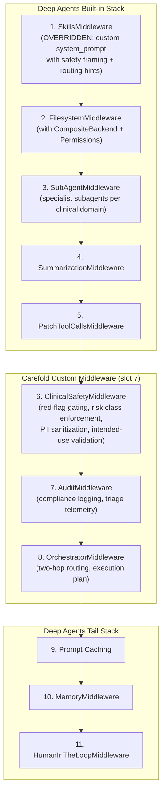
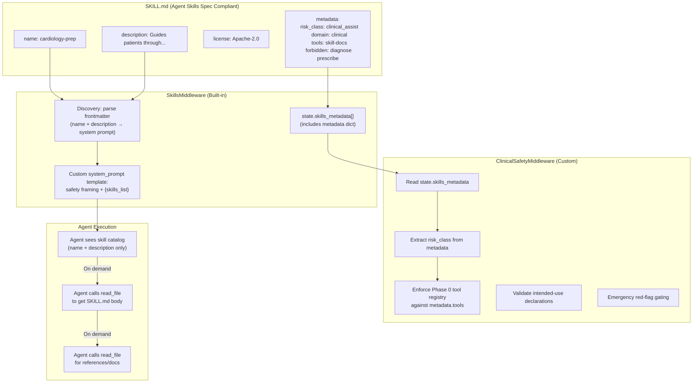

# ADR-0003: Adopt LangGraph Deep Agents with Extended SkillsMiddleware

## Metadata

| Property | Value |
|---|---|
| **Status** | `Proposed` |
| **Date** | 2026-10-02 |
| **Authors** | Spectrayan Architecture Team (`architecture@spectrayan.com`) |
| **Deciders** | Carefold Core Maintainers, Clinical AI Reviewers |
| **Consulted** | Medical Informatics Lead, Security Engineering Team |
| **Informed** | Carefold Open-Source Community |
| **Supersedes** | Partially supersedes skill-provisioning aspects of ADR-0001 §Phase 3 |
| **Related** | ADR-0001 (Orchestrator Architecture), ADR-0002 (Hexagonal Memory Ports) |

---

## Context & Problem Statement

Carefold's current skill-context pipeline suffers from **prompt bloat** and **eager over-provisioning**. When a specialist agent (e.g., `cardiology-guide`) is invoked, the system concatenates:

1. The full safety preamble (~200 tokens).
2. The complete agent persona (`persona.md`, 500–1500 tokens).
3. **Every** declared skill's full `SKILL.md` instruction body — e.g., `cardiology-prep`, `emergency-red-flags`, `clinical-safety-boundaries` (~1500–3000 tokens combined).
4. **Every** orchestrator-provisioned reference document — pre-fetched by keyword-matching stem tokens (~2000–8000 tokens).
5. Any dynamically generated skills and their reference material.

For a typical consultation, **8,000–15,000 tokens** of skill and reference content enter the system prompt on turn 1, regardless of query complexity. A simple question like _"What should I bring to my cardiology appointment?"_ pays the same context cost as a complex multimorbid symptom chronology.

### Specific Architectural Deficiencies

1. **No Progressive Disclosure**: Carefold loads all skill tiers simultaneously during `OrchestratorNode._preflight_prepare_skills_and_docs()` and `AgentExecutionNode._resolve_system_prompt()`. LangGraph Deep Agents uses 3-tier loading: metadata → instructions → resources.

2. **Keyword-Based Reference Over-Provisioning**: The orchestrator uses naive stem-token matching (`stem_tokens in prompt_lower`) to decide which reference documents to pre-load, causing false positives and false negatives.

3. **Redundant Tooling**: The sandboxed `skill-docs` tool exists with fail-closed authorization, fuzzy matching, and path-traversal protection — but is rarely used because the orchestrator pre-stuffs all references into the prompt.

4. **No Middleware Architecture**: Carefold has no equivalent to the Deep Agents layered middleware stack. All context assembly is hardcoded across `OrchestratorNode`, `AgentExecutionNode`, and `agent_execution_prompt.hbs`.

5. **No Storage Abstraction**: Skills are loaded exclusively from the local filesystem. No equivalent to `StateBackend`, `StoreBackend`, or `CompositeBackend`.

### LangGraph Deep Agents — Key Extensibility Points

After exhaustive review of the Deep Agents customization documentation, three critical extensibility mechanisms make it possible to **use `deepagents` as a direct dependency** without rewriting the `SkillsMiddleware`:

#### 1. SkillsMiddleware Override via `.name` Matching (`deepagents>=0.7`)

Per the [customization docs](https://docs.langchain.com/oss/python/deepagents/customization#override-a-default-middleware-instance):

> _"Pass a middleware instance whose `.name` matches an entry in the Deep Agents stack to **replace** that built-in instance in place instead of appending a duplicate."_

This means we can pass a **customized `SkillsMiddleware` instance** with our own `system_prompt` template — including clinical safety routing hints, risk class annotations, and Carefold-specific framing — and it **replaces the default** in the stack at the same position (slot 1, before `FilesystemMiddleware`).

```python
from deepagents.middleware.skills import SkillsMiddleware

carefold_skills_prompt = """## Carefold Skill Catalog
⚠ CLINICAL SAFETY: You are a clinical_assist agent. Never diagnose, prescribe, or replace emergency services.

Routing hints:
- For emergency symptoms → HALT and trigger red-flag protocol
- Read the SKILL.md file for any skill before providing guidance

{skills_locations}

{skills_list}

{skills_load_warnings}
"""

# Replaces default SkillsMiddleware in the Deep Agents stack
carefold_skills = SkillsMiddleware(
    backend=backend,
    sources=["/skills/"],
    system_prompt=carefold_skills_prompt,
)
```

#### 2. Suppress Auto-Generated Catalog with `system_prompt=None`

For maximum control, the middleware accepts `system_prompt=None` to load skills into `state["skills_metadata"]` without appending anything to the system prompt. This lets Carefold's own orchestrator build a fully custom skill catalog block:

```python
SkillsMiddleware(
    backend=backend,
    sources=["/skills/"],
    system_prompt=None,  # Skills load but no auto-generated catalog
)
```

#### 3. Custom Frontmatter via `metadata` Field

The [Agent Skills specification](https://agentskills.io/specification) defines a `metadata` field as:

> _"`metadata`: No. Arbitrary key-value pairs for additional properties."_

This is **exactly** where Carefold's `risk_class`, `domain`, `category`, `tools`, and `forbidden` fields can live — without conflicting with the spec's required fields (`name`, `description`). The metadata is parsed and available in `state["skills_metadata"]` for our custom middleware to read.

```yaml
---
name: cardiology-prep
description: Guides patients through pre-visit preparation for cardiology consultations including symptom chronology, medication inventory, and question formulation.
license: Apache-2.0
metadata:
  risk_class: clinical_assist
  domain: clinical
  category: cardiology
  tools: skill-docs
  forbidden: diagnose prescribe dose
  version: "1.0.0"
  author: spectrayan
---
```

---

## Decision Drivers

- **DD-1 — Context Efficiency**: Reduce system prompt token consumption by 60–80% for typical single-skill consultations.
- **DD-2 — Clinical Safety Preservation**: All existing safety invariants must remain intact and unweakened.
- **DD-3 — Backward Compatibility**: Existing skills and agents must continue to function during migration.
- **DD-4 — Agent Skills Specification Alignment**: Align with the open [Agent Skills specification](https://agentskills.io/specification).
- **DD-5 — Leverage, Don't Reinvent**: Use `deepagents` as a direct dependency. Extend built-in middleware rather than rewriting it.
- **DD-6 — Storage Abstraction**: Support `FilesystemBackend`, `StoreBackend`, and `CompositeBackend` for future multi-tenant skill storage.
- **DD-7 — On-Demand Reference Retrieval**: Replace keyword-based pre-provisioning with agent-driven `read_file` through the `deepagents` filesystem tools.

---

## Considered Options

### Option 1: Status Quo — Full Prompt Stuffing with Custom Loaders

* **Description**: Maintain current architecture.
* **Pros**: Zero migration effort; deterministic (all context always available).
* **Cons**: 8K–15K tokens per turn; keyword matching is brittle; can't scale past ~25 skills; no storage abstraction; violates progressive disclosure.

### Option 2: Rewrite SkillsMiddleware from Scratch

* **Description**: Create a `CareSkillsMiddleware` that reimplements skill discovery, parsing, caching, and system prompt injection while adding clinical safety fields.
* **Pros**: Total control over every behavior.
* **Cons**: Duplicates ~800 lines of well-tested middleware code. Falls behind on upstream improvements (caching, reload, subagent isolation). Maintenance burden of tracking upstream API changes.

### Option 3: Adopt `deepagents` — Override SkillsMiddleware, Extend via Custom Middleware and `metadata` (Selected)

* **Description**: Add `deepagents` as a direct dependency. Override the built-in `SkillsMiddleware` with a customized `system_prompt` template that includes Carefold's clinical safety framing and routing hints. Move `risk_class`, `domain`, `tools`, and `forbidden` into the `metadata` YAML frontmatter field (spec-compliant). Add a lightweight `ClinicalSafetyMiddleware` as custom middleware for Carefold-specific safety gating, risk class enforcement, and PII sanitization. Use `CompositeBackend` for storage.
* **Pros**:
  - Zero custom skill-loading code — `SkillsMiddleware` handles discovery, parsing, caching, and 3-tier progressive disclosure.
  - Custom `system_prompt` template lets us inject clinical safety framing, routing hints, and risk class annotations without touching middleware internals.
  - `metadata` field is spec-compliant — Carefold fields sit in `metadata:` YAML block and flow through to `state["skills_metadata"]`.
  - All upstream improvements (prompt caching, summarization, subagent isolation, skill reload) come for free.
  - Custom middleware (`ClinicalSafetyMiddleware`) handles Carefold-specific concerns in the standard middleware stack.
  - `CompositeBackend` and `FilesystemPermission` provide storage abstraction and permissions out of the box.
* **Cons**:
  - Hard dependency on `deepagents>=0.7`.
  - Must move `carefold.yaml` fields into SKILL.md `metadata` frontmatter (one-time migration).
  - Override replaces default SkillsMiddleware entirely — must fully configure `backend` and `sources`.

---

## Decision Outcome

**Chosen Option**: **Option 3: Adopt `deepagents` — Override SkillsMiddleware, Extend via Custom Middleware and `metadata`**

### Justification

LangGraph Deep Agents provides **three precise extensibility hooks** that cover Carefold's needs without reimplementation:

1. **`SkillsMiddleware(system_prompt=custom_template)`** — override the catalog framing with clinical safety context. Template slots `{skills_locations}`, `{skills_list}`, `{skills_load_warnings}` auto-sync as skills change.

2. **`metadata:` frontmatter field** — the Agent Skills spec explicitly reserves this for arbitrary key-value pairs. Carefold's `risk_class`, `domain`, `category`, `tools`, `forbidden` fit naturally here, remain parseable by `SkillsMiddleware`, and flow to `state["skills_metadata"]` for downstream middleware to consume.

3. **Custom middleware via `middleware=`** — Carefold-specific safety, audit, and orchestration logic runs as standard `AgentMiddleware` in the Deep Agents stack, positioned after the core middleware and operating on the skill metadata injected by `SkillsMiddleware`.

### Architectural Diagram — Deep Agents Stack with Carefold Extensions



### Architectural Diagram — Skill Loading Flow



---

## Detailed Design

### 1. Unified SKILL.md Format — Merge `carefold.yaml` into `metadata`

Currently Carefold uses two files per skill: `SKILL.md` (frontmatter + instructions) and `carefold.yaml` (Carefold-specific fields). The Agent Skills spec's `metadata` field consolidates both:

**Before (two files):**

```
skills/cardiology-prep/
├── SKILL.md           # name, description, instructions
├── carefold.yaml      # risk_class, domain, tools, forbidden
└── references/
```

```yaml
# carefold.yaml
id: cardiology-prep
version: "1.0.0"
domain: clinical
category: cardiology
risk_class: clinical_assist
tools: [skill-docs]
forbidden: [diagnose, prescribe, dose]
```

**After (single file, spec-compliant):**

```
skills/cardiology-prep/
├── SKILL.md           # Everything in frontmatter metadata
└── references/
```

```yaml
# SKILL.md frontmatter
---
name: cardiology-prep
description: Guides patients through pre-visit preparation for cardiology consultations including symptom chronology, medication inventory, vital sign tracking, and question formulation for their cardiologist.
license: Apache-2.0
compatibility: Requires local LLM or API key for model access
metadata:
  risk_class: clinical_assist
  domain: clinical
  category: cardiology
  version: "1.0.0"
  author: spectrayan
  tools:
    - skill-docs
  forbidden:
    - diagnose
    - prescribe
    - dose
  evals: null
allowed-tools: skill-docs
---
```

### 2. Custom SkillsMiddleware Override

Override the built-in `SkillsMiddleware` with a custom `system_prompt` template that includes Carefold clinical safety context. The template **must** include `{skills_locations}`, `{skills_list}`, and `{skills_load_warnings}` — the middleware auto-substitutes these on every turn.

```python
from deepagents import create_deep_agent
from deepagents.backends.filesystem import FilesystemBackend
from deepagents.backends import CompositeBackend, StateBackend
from deepagents.middleware.skills import SkillsMiddleware

CAREFOLD_SKILLS_PROMPT = """\
## Available Skills

⚠ **CLINICAL SAFETY BOUNDARY**: You are a healthcare navigation assistant.
You do NOT provide medical diagnoses, prescribe treatments, or replace emergency services.
For life-threatening emergencies, immediately direct to 911 / 988.

### Skill Activation Protocol
1. Review the catalog below — each skill has a `name` and `description`.
2. When a skill matches the user's query, read its full instructions:
   `read_file("skills/<skill-name>/SKILL.md")`
3. Follow the skill's instructions. If they reference documents, read them:
   `read_file("skills/<skill-name>/references/<document>")`
4. Never provide guidance beyond what the activated skill's instructions authorize.

### Skill Sources
{skills_locations}

### Catalog
{skills_list}

{skills_load_warnings}
"""

skills_backend = FilesystemBackend(root_dir="/path/to/carefold/skills")

carefold_skills_middleware = SkillsMiddleware(
    backend=skills_backend,
    sources=["/skills/"],
    system_prompt=CAREFOLD_SKILLS_PROMPT,
)
```

### 3. ClinicalSafetyMiddleware — Carefold-Specific Custom Middleware

This is a standard `AgentMiddleware` that runs in the custom middleware slot (position 7 in the stack). It reads `state["skills_metadata"]`, extracts Carefold's `metadata` fields, and enforces safety invariants:

```python
from typing import Any
from langchain.agents.middleware import AgentMiddleware
from deepagents.middleware import SkillsState


class ClinicalSafetyMiddleware(AgentMiddleware[SkillsState]):
    """Enforce Carefold clinical safety invariants on Deep Agents skill metadata."""

    state_schema = SkillsState

    def before_agent(self, state: SkillsState, runtime) -> dict[str, Any] | None:
        skills_metadata = state.get("skills_metadata") or []

        # Extract risk classes from metadata fields
        max_risk = "admin"
        for skill in skills_metadata:
            meta = skill.get("metadata", {}) or {}
            risk = meta.get("risk_class", "admin")
            if risk == "clinical_assist":
                max_risk = "clinical_assist"

            # Validate tools against Phase 0 registry
            tools = meta.get("tools", [])
            for tool in tools:
                if tool not in PHASE_0_TOOL_REGISTRY:
                    raise ToolValidationError(
                        f"Skill '{skill['name']}' declares unauthorized tool: {tool}"
                    )

        # Inject elevated safety context for clinical_assist agents
        if max_risk == "clinical_assist":
            return {"carefold_risk_class": max_risk}
        return None
```

### 4. Agent Construction with `create_deep_agent`

```python
from deepagents import create_deep_agent, FilesystemPermission
from deepagents.backends.filesystem import FilesystemBackend
from deepagents.backends import CompositeBackend, StateBackend
from langgraph.checkpoint.memory import MemorySaver

# Composite backend: skills from disk, workspace in-state
backend = CompositeBackend(
    default=StateBackend(),
    routes={
        "/skills/": FilesystemBackend(root_dir="/path/to/carefold/skills"),
        "/workspace/": FilesystemBackend(root_dir="/path/to/carefold/workspace"),
    },
)

# Permissions: skills are read-only, workspace is writable
permissions = [
    FilesystemPermission(operations=["write"], paths=["/skills/**"], mode="deny"),
    FilesystemPermission(operations=["read", "write"], paths=["/workspace/**"], mode="allow"),
]

agent = create_deep_agent(
    model="google_genai:gemini-3.6-flash",  # or ollama:..., anthropic:..., etc.
    backend=backend,
    skills=["/skills/"],
    memory=["/workspace/AGENTS.md"],
    permissions=permissions,
    middleware=[
        carefold_skills_middleware,     # Replaces default SkillsMiddleware (slot 1)
        ClinicalSafetyMiddleware(),     # Custom (slot 7 — after PatchToolCalls)
        AuditMiddleware(),              # Custom (slot 7 — after ClinicalSafety)
    ],
    tools=[                             # Carefold domain tools
        attach_read_tool,
        workspace_note_tool,
        sanitize_pii_tool,
        extract_structured_data_tool,
        validate_grounding_tool,
        delegate_to_agent_tool,
        list_agents_tool,
    ],
    subagents=specialist_subagents,     # 22 clinical/admin specialist subagents
    interrupt_on={
        "write_file": True,             # HITL for file writes
        "delegate_to_agent": False,     # Auto-approve delegation
    },
    checkpointer=MemorySaver(),
)
```

### 5. Persona → Profile Mapping — Decomposing `persona.md`

Every Carefold `persona.md` follows a **rigid 5-section anatomy**:

```
┌─────────────────────────────────────────┐
│ ROLE & EMPATHY                          │  ← Agent identity, bedside manner, mission
│                                         │
│ CLINICAL SCOPE & FOCUS                  │  ← Domain boundaries, what the agent does
│                                         │
│ STRUCTURED INTERACTION PROTOCOL         │  ← 4-step methodology for patient interactions
│                                         │
│ STRICT NON-CLINICAL BOUNDARIES          │  ← Safety contract (never diagnose/prescribe)
│                                         │
│ EXPLICIT EMERGENCY RED FLAGS            │  ← Red-flag patterns → 911 escalation
└─────────────────────────────────────────┘
```

Similarly, `agent.yaml` carries operational metadata:

```yaml
id: cardiology-guide
title: Cardiology Navigator
model: llama3.2
risk_class: wellness
domain: clinical
category: clinical.cardiology
description: >-
  Cardiovascular care navigator assisting patients with...
skills: [cardiology-prep]
tools: [attach-read, skill-docs, workspace-note]
forbidden: [diagnose, prescribe, dose, replace_emergency_care]
persona: persona.md
```

LangGraph Deep Agents' [Profiles](https://docs.langchain.com/oss/python/deepagents/profiles) system maps cleanly to this structure via `HarnessProfile` + subagent `system_prompt`:

#### Mapping Table

| `persona.md` Section | Deep Agents Destination | Rationale |
|---|---|---|
| **ROLE & EMPATHY** | Subagent `system_prompt` | This is the agent's identity — exactly what `system_prompt` is for |
| **CLINICAL SCOPE & FOCUS** | Subagent `system_prompt` (appended) | Domain-specific context the agent always needs |
| **STRUCTURED INTERACTION PROTOCOL** | Moved to `SKILL.md` instructions | This is task-specific methodology — belongs in a skill, not identity. Progressive disclosure means it loads only when the agent activates the skill |
| **STRICT NON-CLINICAL BOUNDARIES** | `HarnessProfile.system_prompt_suffix` | Safety contract is model-level — applies to **every** agent/subagent using that model, via profile suffix |
| **EXPLICIT EMERGENCY RED FLAGS** | `HarnessProfile.system_prompt_suffix` | Emergency protocol is also model-level — universal across all agents |

#### Why This Decomposition

1. **ROLE & EMPATHY** and **CLINICAL SCOPE** define *who* the agent is — this is identity, belonging in `system_prompt`. It runs on every turn.

2. **STRUCTURED INTERACTION PROTOCOL** defines *how* the agent works — this is procedural methodology. Currently stuffed into the persona (~400 tokens per agent), it belongs in the skill's `SKILL.md` instructions. Under progressive disclosure, the agent reads it only when activated — **saving ~400 tokens on every turn** where the protocol isn't needed.

3. **NON-CLINICAL BOUNDARIES** and **EMERGENCY RED FLAGS** are **identical across all 22 specialist agents** (with minor domain-specific wording). Currently duplicated in every `persona.md`. As a `HarnessProfile.system_prompt_suffix`, they're declared **once** and applied everywhere via the profile merge system.

#### Concrete Implementation

**Step 1: Register a Carefold `HarnessProfile` for each model**

The safety suffix is registered per-model (or per-provider). Per the [profiles docs](https://docs.langchain.com/oss/python/deepagents/profiles#registration-keys), provider-level applies to all models from that provider. Model-level overrides inherit from provider-level.

```python
from deepagents import HarnessProfile, register_harness_profile

# Shared safety suffix — applied to ALL Carefold agents regardless of model
CAREFOLD_SAFETY_SUFFIX = """\

STRICT NON-CLINICAL BOUNDARIES:
You are an educational and administrative navigation companion, NOT a licensed physician or emergency responder.
- You NEVER diagnose medical conditions or interpret clinical laboratory results.
- You NEVER prescribe medications, recommend treatments, or calculate drug dosages.
- You NEVER instruct patients to start, stop, adjust, or discontinue prescribed therapies.
- You must explicitly remind users to consult their licensed physician before modifying any medical treatment.

EXPLICIT EMERGENCY RED FLAGS:
If a user describes acute, potentially life-threatening symptoms — including crushing chest pain;
pain radiating to the arm, jaw, or back; sudden shortness of breath; signs of stroke (FAST criteria);
anaphylaxis; severe hemorrhaging; or active suicidal ideation — you must IMMEDIATELY instruct them to
call 911 (or local emergency services) or go to the nearest emergency department.
Do NOT continue routine navigation during emergency presentations.
"""

# Register for each model Carefold uses
for model_key in ["ollama:llama3.2", "google_genai:gemini-3.6-flash", "anthropic:claude-sonnet-4-6"]:
    register_harness_profile(
        model_key,
        HarnessProfile(system_prompt_suffix=CAREFOLD_SAFETY_SUFFIX),
    )
```

Per the [merge semantics](https://docs.langchain.com/oss/python/deepagents/profiles#merge-semantics), `system_prompt_suffix` from the profile is appended **after** the caller's `system_prompt` and any `base_system_prompt`. This means every agent and subagent using these models automatically gets the safety contract — **no duplication** across 22 persona files.

**Step 2: Build subagent `system_prompt` from persona.md sections 1–2**

```python
def build_subagent_prompt(agent_dir: Path) -> str:
    """Extract ROLE & EMPATHY + CLINICAL SCOPE from persona.md for system_prompt.

    STRUCTURED INTERACTION PROTOCOL moves to SKILL.md.
    NON-CLINICAL BOUNDARIES + EMERGENCY RED FLAGS move to HarnessProfile suffix.
    """
    persona_text = (agent_dir / "persona.md").read_text()
    sections = parse_persona_sections(persona_text)

    # Only ROLE & EMPATHY + CLINICAL SCOPE go into system_prompt
    return f"""{sections['role_and_empathy']}

{sections['clinical_scope']}"""


def parse_persona_sections(text: str) -> dict[str, str]:
    """Parse the 5-section persona.md into a dict keyed by section name."""
    import re
    section_pattern = re.compile(
        r"^(ROLE & EMPATHY|CLINICAL SCOPE & FOCUS|STRUCTURED INTERACTION PROTOCOL|"
        r"STRICT NON-CLINICAL BOUNDARIES|EXPLICIT EMERGENCY RED FLAGS):\s*$",
        re.MULTILINE,
    )
    # ... split text by section headers, return dict
```

**Step 3: Move STRUCTURED INTERACTION PROTOCOL into SKILL.md**

The 4-step protocol currently in `persona.md` belongs in the skill's `SKILL.md` body — it's task-specific methodology, not agent identity. Example for `cardiology-prep`:

```markdown
---
name: cardiology-prep
description: Guides patients through pre-visit preparation for cardiology consultations...
metadata:
  risk_class: clinical_assist
  domain: clinical
---

# Cardiology Visit Preparation

## Structured Interaction Protocol
When a user seeks guidance, follow this 4-step structured protocol:
1. **Clarify Context**: Inquire about the upcoming cardiology visit type...
2. **Synthesize Vitals & History**: Help organize home blood pressure logs...
3. **Formulate Top Questions**: Guide the user to select 3-5 prioritized questions...
4. **Synthesize Consultation Agenda**: Structure priorities into a visit agenda...

## Reference Documents
- `references/bp-log-template.md` — Blood pressure tracking template
- `references/cardiac-question-guide.md` — Question formulation guide
```

Under progressive disclosure, this **only loads when the agent activates `cardiology-prep`** — not on every turn.

### 6. Unify `agent.yaml` with Deep Agents YAML Contracts

`HarnessProfileConfig` supports direct YAML loading via `from_dict()` — but it covers only the **harness-level** concerns (prompt, excluded tools/middleware, GP subagent). Our `agent.yaml` carries **22 fields**, most of which map to different Deep Agents constructs. Rather than maintaining a custom `agent_loader.py` → `AgentManifest` → `_resolve_system_prompt()` pipeline, we can decompose `agent.yaml` so that:

1. **Harness-level fields** → a single `carefold-profile.yaml` (loaded via `HarnessProfileConfig.from_dict()`)
2. **Per-agent runtime fields** → the `SubAgent` dict (constructed at startup from a thin YAML)
3. **Clinical domain fields** → `SKILL.md` `metadata:` (already covered in Section 1)
4. **Marketplace/UI fields** → a separate `metadata.yaml` (consumed by the web frontend, not the runtime)

#### Field-by-Field Disposition

| `agent.yaml` Field | Deep Agents Destination | Notes |
|---|---|---|
| **Harness-level (shared across models)** | | |
| `forbidden` | `HarnessProfileConfig.system_prompt_suffix` | Safety contract text; registered once per model via `register_harness_profile()` |
| — | `HarnessProfileConfig.excluded_tools` | Map `forbidden` verbs to tool exclusion where applicable |
| — | `HarnessProfileConfig.excluded_middleware` | Not currently used, but available |
| — | `HarnessProfileConfig.general_purpose_subagent` | Disable GP subagent (Carefold uses explicit specialist routing) |
| **Per-agent runtime** | | |
| `id` | `SubAgent["name"]` | Direct mapping |
| `description` | `SubAgent["description"]` | Direct mapping |
| `persona` | `SubAgent["system_prompt"]` | ROLE + SCOPE only (canonical `persona.md`) |
| `model` | `SubAgent["model"]` | Direct mapping (`"ollama:llama3.2"`) |
| `skills` | `SubAgent["skills"]` | Direct mapping (`["/skills/cardiology-prep/"]`) |
| `tools` | `SubAgent["tools"]` | Resolved to tool callables against Phase 0 registry |
| `max_iterations` | `create_deep_agent(recursion_limit=)` | Per-agent iteration cap |
| `can_delegate` | `SubAgent["tools"]` inclusion of `delegate_to_agent` | Conditional tool presence |
| **Clinical domain (to SKILL.md metadata)** | | |
| `risk_class` | `SKILL.md` `metadata.risk_class` | Read by `ClinicalSafetyMiddleware` from `state["skills_metadata"]` |
| `domain` | `SKILL.md` `metadata.domain` | Used for routing, not runtime behavior |
| `category` | `SKILL.md` `metadata.category` | Used for routing, not runtime behavior |
| **Marketplace/UI only** | | |
| `title` | `metadata.yaml` | Display name for web UI |
| `version` | `metadata.yaml` | Marketplace version badge |
| `license` | `metadata.yaml` | License display |
| `care_stages` | `metadata.yaml` | Filter facets in marketplace UI |
| `target_audience` | `metadata.yaml` | Filter facets in marketplace UI |
| `tags` | `metadata.yaml` | Search/filter in marketplace UI |
| `icon` | `metadata.yaml` | UI icon identifier |
| `maturity` | `metadata.yaml` | Stability badge |
| `hidden` | `metadata.yaml` | Marketplace visibility toggle |

#### Resulting File Layout per Agent

**Before (current):**
```
agents/cardiology-guide/
├── agent.yaml          # 45 lines — mixes runtime, safety, marketplace, persona ref
└── persona.md          # 19 lines — mixes identity, protocol, safety, emergencies
```

**After (canonical layout — single persona.md):**
```
agents/cardiology-guide/
├── agent.yaml          # SLIM: only SubAgent-mappable fields (name, description, model, skills, tools)
├── persona.md          # SLIM identity: ROLE & EMPATHY + CLINICAL SCOPE only (~400 tokens)
└── metadata.yaml       # UI/catalog fields (title, icon, tags, care_stages, etc.)
```

#### Shared Carefold Profile YAML

A **single** `carefold-profile.yaml` at the project root replaces the safety contract that was duplicated across 22 `persona.md` files. It's loaded via `HarnessProfileConfig.from_dict()` and registered for each model Carefold supports:

```yaml
# carefold-profile.yaml — loaded once, applied to all agents per model
system_prompt_suffix: |
  STRICT NON-CLINICAL BOUNDARIES:
  You are an educational and administrative navigation companion, NOT a licensed
  physician or emergency responder.
  - You NEVER diagnose medical conditions or interpret clinical laboratory results.
  - You NEVER prescribe medications, recommend treatments, or calculate drug dosages.
  - You NEVER instruct patients to start, stop, adjust, or discontinue prescribed therapies.

  EXPLICIT EMERGENCY RED FLAGS:
  If a user describes acute, potentially life-threatening symptoms — including crushing
  chest pain; pain radiating to the arm, jaw, or back; sudden shortness of breath;
  signs of stroke (FAST criteria); anaphylaxis; severe hemorrhaging; or active suicidal
  ideation — you must IMMEDIATELY instruct them to call 911 and go to the nearest
  emergency department. Do NOT continue routine navigation.

general_purpose_subagent:
  enabled: false
```

```python
# Loaded at startup — zero custom profile code
import yaml
from deepagents import HarnessProfileConfig, register_harness_profile

with open("carefold-profile.yaml") as f:
    profile_config = HarnessProfileConfig.from_dict(yaml.safe_load(f))

# Register for every model Carefold supports
for model_key in ["ollama:llama3.2", "google_genai:gemini-3.6-flash", "anthropic:claude-sonnet-4-6"]:
    register_harness_profile(model_key, profile_config)
```

#### Slim agent.yaml → SubAgent Dict

The per-agent `agent.yaml` shrinks to only the fields the runtime needs — everything else moves to `metadata.yaml` (web UI) or `SKILL.md metadata` (clinical safety):

```yaml
# agents/cardiology-guide/agent.yaml (SLIM — runtime only)
name: cardiology-guide
description: >-
  Cardiovascular care navigator assisting patients with hypertension tracking,
  arrhythmia consultation prep, heart health lifestyle agendas, and vital sign logs.
model: ollama:llama3.2
skills:
  - /skills/cardiology-prep/
tools:
  - attach-read
  - skill-docs
  - workspace-note
persona: persona.md
```

```python
def load_subagent_from_yaml(agent_dir: Path) -> dict:
    """Build a Deep Agents SubAgent dict from the slim agent.yaml.

    No custom AgentManifest, no agent_loader.py — just YAML → dict.
    """
    raw = yaml.safe_load((agent_dir / "agent.yaml").read_text())

    # Load persona.md for system_prompt (contains slim identity: ROLE + SCOPE)
    persona_file = agent_dir / raw.get("persona", "persona.md")
    system_prompt = persona_file.read_text() if persona_file.exists() else ""

    return {
        "name": raw["name"],
        "description": raw["description"],
        "system_prompt": system_prompt,
        "model": raw.get("model", "ollama:llama3.2"),
        "skills": raw.get("skills", []),
        "tools": resolve_phase0_tools(raw.get("tools", [])),
    }
```

#### What This Eliminates

| Custom Code | Status | Replaced By |
|---|---|---|
| `agent_loader.py` (`load_agent()`, 367 lines) | **Eliminated** | `load_subagent_from_yaml()` (~20 lines) + `SubAgent` dict |
| `AgentManifest` Pydantic model (22 fields) | **Eliminated** | `SubAgent` dict fields (6 fields) |
| `AgentPersonaObject` model | **Eliminated** | String `system_prompt` from `persona.md` |
| `_resolve_system_prompt()` (160 lines) | **Eliminated** | `system_prompt` + `HarnessProfile.system_prompt_suffix` |
| `agent_execution_prompt.hbs` (71 lines) | **Eliminated** | `SkillsMiddleware.system_prompt` template + profile suffix |
| `compute_effective_tools()` | **Simplified** | `resolve_phase0_tools()` validates against registry, tools go to `SubAgent["tools"]` |
| Safety contract duplication (22 × persona.md) | **Eliminated** | Single `carefold-profile.yaml` → `HarnessProfileConfig.from_dict()` |
| Risk class elevation logic | **Moved** | `ClinicalSafetyMiddleware` reads `SKILL.md metadata.risk_class` |

**Net reduction**: ~600 lines of custom loader/assembly code replaced by ~50 lines of YAML loading + Deep Agents native constructs.

#### Token Savings (per agent, per turn)

| Component | Before (in `persona.md`) | After | Savings |
|---|---|---|---|
| ROLE & EMPATHY | ~200 tokens ✓ | ~200 tokens (in `system_prompt`) | 0 |
| CLINICAL SCOPE | ~200 tokens ✓ | ~200 tokens (in `system_prompt`) | 0 |
| STRUCTURED PROTOCOL | ~400 tokens ✓ | 0 (moved to `SKILL.md`, on-demand) | **~400 tokens** |
| NON-CLINICAL BOUNDARIES | ~250 tokens ✓ (duplicated ×22) | ~250 tokens × 1 (via `HarnessProfile`) | **~250 tokens** per agent |
| EMERGENCY RED FLAGS | ~200 tokens ✓ (duplicated ×22) | ~200 tokens × 1 (via `HarnessProfile`) | **~200 tokens** per agent |
| **Total per agent per turn** | ~1,250 tokens | ~400 tokens + 450 shared | **~850 tokens saved** |

The safety suffix from `HarnessProfile` is paid once regardless of which agent or subagent is active — it's **shared infrastructure**, not per-agent cost.

### 8. Preserved Safety Invariants

| Invariant | How It's Preserved |
|---|---|
| Phase 0 Closed Tool Registry | `ClinicalSafetyMiddleware.before_agent()` validates `metadata.tools` against Phase 0 set |
| Risk Class Elevation | `ClinicalSafetyMiddleware.before_agent()` scans `metadata.risk_class` across all loaded skills |
| Mandatory Intended-Use Declarations | `ClinicalSafetyMiddleware` reads and validates SKILL.md body for required disclaimer lines |
| Emergency Red-Flag Gating | `HarnessProfile.system_prompt_suffix` carries red-flag protocol; `ClinicalSafetyMiddleware.before_model()` validates |
| PII Sanitization | `sanitize_pii` remains a registered tool; `before_tool` hook validates PII in tool args |
| Sandboxed Path Resolution | `FilesystemPermission(mode="deny")` on `/skills/**` writes; `FilesystemBackend` handles path sandboxing |
| Tool Union Computation | `metadata.tools` validated at startup; subagent `tools` explicitly declared per subagent |
| Penetration Test Harness | All 47 attack vectors tested against the new middleware stack |
| Non-Clinical Boundaries | `HarnessProfile.system_prompt_suffix` carries boundaries — applied to ALL agents universally |

### 9. Migration Strategy

#### 9a. SKILL.md Frontmatter Migration (carefold.yaml → metadata)

A one-time migration script moves `carefold.yaml` fields into `SKILL.md` `metadata`:

```python
"""Migrate carefold.yaml fields into SKILL.md metadata frontmatter."""

def migrate_skill(skill_dir: Path):
    skill_md = skill_dir / "SKILL.md"
    carefold_yaml = skill_dir / "carefold.yaml"

    # Parse existing frontmatter
    frontmatter, body = parse_frontmatter(skill_md.read_text())

    # Load carefold.yaml
    carefold = yaml.safe_load(carefold_yaml.read_text())

    # Merge into metadata
    frontmatter.setdefault("metadata", {})
    for key in ["risk_class", "domain", "category", "version", "tools", "forbidden", "evals"]:
        if key in carefold:
            frontmatter["metadata"][key] = carefold[key]

    # Add license if missing
    frontmatter.setdefault("license", "Apache-2.0")

    # Map tools to allowed-tools
    if carefold.get("tools"):
        frontmatter["allowed-tools"] = " ".join(carefold["tools"])

    # Write updated SKILL.md
    write_frontmatter(skill_md, frontmatter, body)

    # Archive (don't delete) carefold.yaml
    carefold_yaml.rename(skill_dir / "carefold.yaml.migrated")
```

#### 9b. Persona.md Decomposition Migration

A second migration script decomposes each `persona.md` into its target locations:

```python
"""Decompose persona.md into system_prompt + SKILL.md + HarnessProfile suffix."""

def migrate_persona(agent_dir: Path, skill_dirs: list[Path]):
    persona_text = (agent_dir / "persona.md").read_text()
    sections = parse_persona_sections(persona_text)

    # 1. Overwrite persona.md in-place with the slimmed identity (ROLE + SCOPE only)
    slim_persona = f"{sections['role_and_empathy']}\n\n{sections['clinical_scope']}"
    (agent_dir / "persona.md").write_text(slim_persona)

    # 2. Append STRUCTURED INTERACTION PROTOCOL to primary skill's SKILL.md body
    if skill_dirs:
        primary_skill_md = skill_dirs[0] / "SKILL.md"
        frontmatter, body = parse_frontmatter(primary_skill_md.read_text())
        protocol = sections.get("structured_interaction_protocol", "")
        if protocol and protocol not in body:
            body = f"{body}\n\n## Structured Interaction Protocol\n{protocol}"
            write_frontmatter(primary_skill_md, frontmatter, body)

    # 3. NON-CLINICAL BOUNDARIES + EMERGENCY RED FLAGS → centralized in carefold-profile.yaml
    # 4. Note: Git history preserves original versions; no temporary .migrated files remain in the final repository tree.
```

#### 9c. agent.yaml Decomposition Migration

A third migration script splits each `agent.yaml` into a slim runtime YAML + metadata YAML:

```python
"""Decompose agent.yaml into slim runtime YAML + metadata YAML."""

RUNTIME_FIELDS = {"name", "description", "model", "skills", "tools", "persona"}
METADATA_FIELDS = {"title", "version", "license", "care_stages", "target_audience",
                   "tags", "icon", "maturity", "hidden"}

def migrate_agent_yaml(agent_dir: Path):
    raw = yaml.safe_load((agent_dir / "agent.yaml").read_text())

    # 1. Build slim agent.yaml (runtime fields only)
    slim = {}
    slim["name"] = raw.get("id", raw.get("name"))
    for key in ["description", "model", "skills", "tools"]:
        if key in raw:
            slim[key] = raw[key]
    # Set canonical persona reference
    slim["persona"] = "persona.md"
    # Prefix model with provider if bare
    if "model" in slim and ":" not in str(slim["model"]):
        slim["model"] = f"ollama:{slim['model']}"
    # Prefix skills with /skills/ path
    if "skills" in slim:
        slim["skills"] = [f"/skills/{s}/" if not s.startswith("/") else s
                          for s in slim["skills"]]

    # 2. Build metadata.yaml (UI and catalog fields)
    metadata = {k: raw[k] for k in METADATA_FIELDS if k in raw}

    # 3. Write both
    (agent_dir / "agent.yaml").write_text(yaml.dump(slim, sort_keys=False))
    (agent_dir / "metadata.yaml").write_text(yaml.dump(metadata, sort_keys=False))

    # 4. forbidden → already in carefold-profile.yaml (shared)
    # 5. risk_class, domain, category → already in SKILL.md metadata (9a)
```

---

## Consequences

### Positive Consequences
- **60–80% reduction** in baseline system prompt tokens for typical consultations.
- **Zero custom skill-loading code** — `SkillsMiddleware` handles discovery, parsing, caching, and 3-tier progressive disclosure out of the box.
- **Agent Skills spec compliance** — skills become interoperable with the broader `deepagents` ecosystem and community skill packs.
- **Storage abstraction for free** — `CompositeBackend` enables future multi-tenant skill libraries without additional work.
- **Upstream improvements for free** — prompt caching, summarization, subagent isolation, and skill reload come from `deepagents` releases.
- **Permissions for free** — `FilesystemPermission` provides path-level `allow`/`deny`/`interrupt` without custom code.
- **HITL for free** — `interrupt_on` provides configurable human approval flows.
- **Clean separation of concerns** — safety invariants live in `ClinicalSafetyMiddleware`, not scattered across orchestrator and execution nodes.

### Negative Consequences
- **Hard dependency on `deepagents>=0.7`** — tied to LangGraph ecosystem evolution.
- **One-time migration** of 23 skill packs (merging `carefold.yaml` into `SKILL.md` `metadata`) — estimated 1 day with migration script.
- **1–2 additional tool calls per consultation** for on-demand skill/reference retrieval (~1–3 seconds).
- **Override replaces entirely** — the custom `SkillsMiddleware` instance must be fully configured with `backend` and `sources`.

### Neutral / Preserved Behaviors
- The 5-phase LangGraph lifecycle can be adapted to work within the Deep Agents middleware hooks.
- SSE streaming from the web UI connects to `agent.stream()`.
- The penetration test harness (47 attacks) continues to pass.
- All `metadata` fields (`risk_class`, `domain`, `tools`, `forbidden`) remain functional via `state["skills_metadata"]`.

---

## Verification & Code References

### Core Implementation Files (To Be Modified)
- **Skill Manifests**: All 23 `skills/*/SKILL.md` files — add `metadata` block, add `license` field
- **Migration Script**: `backend/scripts/migrate_carefold_yaml.py` (new)
- **Agent Construction**: `backend/src/carefold/engine/agent_factory.py` (new — replaces parts of registry.py)
- **Safety Middleware**: `backend/src/carefold/middleware/clinical_safety.py` (new)
- **Audit Middleware**: `backend/src/carefold/middleware/audit.py` (new)

### Core Implementation Files (Unchanged — Safety Invariants)
- **Frontmatter Validator**: `backend/src/carefold/loaders/frontmatter.py` — `check_mandatory_intended_use()` still validates SKILL.md body
- **Tool Registry**: `backend/src/carefold/loaders/union.py` — Phase 0 registry constants
- **Safety Classifier**: `backend/src/carefold/safety/classifier.py`
- **Emergency Protocol**: `backend/src/carefold/safety/emergency.py`

### New Dependencies
```toml
# pyproject.toml
[project]
dependencies = [
    "deepagents>=0.7",
    "langgraph>=0.3",
    "langchain>=0.4",
]
```

### Verification Commands
```bash
# 1. License Check
pnpm run check:licenses

# 2. Backend Unit & Regression Tests
backend/.venv/bin/pytest backend/tests/

# 3. Security Penetration Suite (47 Attacks)
PYTHONPATH=backend/src backend/.venv/bin/python backend/tests/penetration_suite.py

# 4. Frontend Typecheck
pnpm --filter web typecheck

# 5. Frontend Unit & Component Tests
pnpm --filter web test --exclude "**/api/**"

# 6. Frontend Production Build
pnpm --filter web build
```
