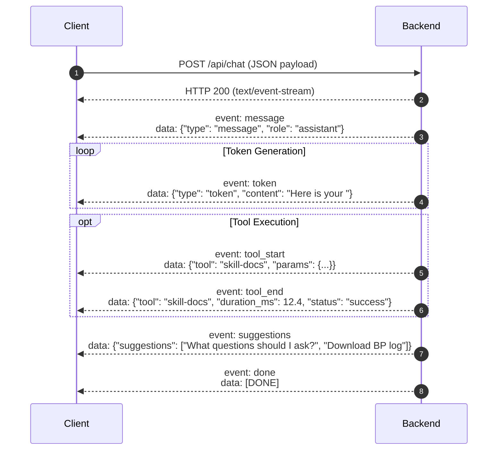

# API Reference & SSE Wire Protocol

The Carefold backend exposes a high-performance REST API and real-time Server-Sent Events (SSE) streaming protocol mounted at prefix `/api`.

---

## REST Endpoints Overview

| Method | Path | Summary |
|---|---|---|
| `GET` | `/api/health` | Service health status, counts, and active memory backend. |
| `POST` | `/api/chat` | Main streaming chat consultation endpoint (Server-Sent Events). |
| `GET` | `/api/chat/threads/{thread_id}` | Retrieves conversation thread checkpoint history. |
| `GET` | `/api/agents` | Lists indexed specialist agents with optional filters. |
| `GET` | `/api/agents/categories` | Hierarchical taxonomy tree with agent counts across domains. |
| `GET` | `/api/agents/{agent_id}` | Detailed agent manifest, declared skills, and persona. |
| `GET` | `/api/skills` | Lists all indexed skill packages. |
| `GET` | `/api/skills/{skill_id}` | Detailed skill manifest and reference document listing. |
| `GET` | `/api/audit` | Retrieves zero-body audit events. |
| `GET` | `/api/models` | Lists available LLM models and configured providers. |
| `POST` | `/api/attachments` | Securely uploads document attachment to sandbox. |
| `GET` | `/api/attachments` | Lists files currently residing in user attachments sandbox. |

---

## Detailed Endpoint Specifications

### 1. Health Check
`GET /api/health`

Returns system health status, runtime uptime, workspace agent/skill counts, and local Ollama inference reachability (`HealthResponse` schema).

**Response Schema (`HealthResponse`)**:

| Field | Type | Description |
|---|---|---|
| `status` | `Literal["ok", "degraded", "error"]` | Overall operational health state (`ok`, `degraded`, or `error`). |
| `version` | `str` | Runtime software release version (e.g., `0.1.0`). |
| `uptime` | `float` | Server uptime in seconds since boot. |
| `timestamp` | `str` | ISO 8601 UTC timestamp. |
| `modelReachable` | `bool` | Boolean flag indicating whether the configured LLM provider is reachable. |
| `workspace` | `WorkspaceInfo` | Workspace statistics: `root` (str), `agentsCount` (int), `skillsCount` (int). |
| `ollama` | `OllamaHealthStatus` | Ollama connection details: `status`, `endpoint`, `reachable`, `activeModel`, `availableModels`, `error`. |

**Response Example (`200 OK`)**:
```json
{
  "status": "ok",
  "version": "0.1.0",
  "uptime": 142.35,
  "timestamp": "2026-10-02T05:00:00.000000+00:00",
  "modelReachable": true,
  "workspace": {
    "root": "/Users/bharatjoshi/git/carefold",
    "agentsCount": 22,
    "skillsCount": 23
  },
  "ollama": {
    "status": "connected",
    "endpoint": "http://127.0.0.1:11434/v1",
    "reachable": true,
    "activeModel": "llama3.2",
    "availableModels": [
      "llama3.2:latest",
      "llama3.1:latest"
    ],
    "error": null
  }
}
```

!!! note
    `agentsCount` and `skillsCount` count workspace directories under `agents/` and `skills/`, so they include `agents/_system` and the `_template` starters in addition to the 20 specialist agents and 22 skill packs.

---

### 2. Streaming Consultation
`POST /api/chat`

Initiates an interactive consultation turn with the multi-agent engine.

**Request Body (`application/json`)**:
```json
{
  "messages": [
    {"role": "user", "content": "How should I prepare for my cardiology visit?"}
  ],
  "agent_id": "cardiology-guide",
  "thread_id": "session-1234-abcd",
  "allow_clinical": true,
  "attachments": []
}
```

**Response Headers**:
```http
HTTP/1.1 200 OK
Content-Type: text/event-stream
Cache-Control: no-cache, no-transform
Connection: keep-alive
X-Accel-Buffering: no
```

---

### 3. Agent Catalog & Taxonomy

#### List Agents
`GET /api/agents?domain=clinical&limit=10`

**Query Parameters**:
- `domain` *(optional)*: Filter by `clinical`, `navigation`, `wellness`, `therapy`, `education`.
- `category` *(optional)*: Filter by category prefix (e.g., `clinical.cardiology`).
- `query` *(optional)*: Full-text search keyword query.
- `limit` *(optional)*: Maximum results (default `10`).

#### Taxonomy Tree
`GET /api/agents/categories`

**Response (`200 OK`)**:
```json
{
  "total": 20,
  "domains": {
    "clinical": {
      "count": 13,
      "categories": {
        "cardiology": {"count": 1, "subcategories": {}},
        "nephrology": {"count": 1, "subcategories": {}},
        "oncology": {"count": 1, "subcategories": {}}
      }
    },
    "navigation": {
      "count": 6,
      "categories": {
        "insurance": {"count": 1, "subcategories": {}},
        "prior_auth": {"count": 1, "subcategories": {}}
      }
    },
    "wellness": {
      "count": 1,
      "categories": {
        "habits": {"count": 1, "subcategories": {}}
      }
    }
  }
}
```

---

## Server-Sent Events (SSE) Wire Protocol

The `/api/chat` streaming response emits Server-Sent Events conforming to the constants defined in `carefold/constants/api.py`.



### Event Payload Formats

#### 1. `token` (Incremental Text Chunk)
```
event: token
data: {"type": "token", "content": "To prepare for your upcoming visit, "}
```

#### 2. `tool_start` & `tool_end` (Tool Observability)
```
event: tool_start
data: {"type": "tool_start", "tool": "skill-docs", "params": {"doc_name": "hypertension_log_template.md"}}

event: tool_end
data: {"type": "tool_end", "tool": "skill-docs", "duration_ms": 14.2, "status": "success", "allowed": true, "result": {"bytes": 482}}
```

#### 3. `suggestions` (Dynamic Contextual Next Steps)
```
event: suggestions
data: {"type": "suggestions", "items": ["How often should I log blood pressure?", "What are red-flag cardiac symptoms?"]}
```

#### 4. `refusal` (Safety Circuit Breaker)
```
event: refusal
data: {"type": "refusal", "reason": "emergency_red_flag", "message": "EMERGENCY WARNING: Acute symptoms detected. Please call 911 or visit the nearest emergency room immediately.", "category": "stroke_fast"}
```

#### 5. `done` (Stream Termination)
```
event: done
data: [DONE]
```
