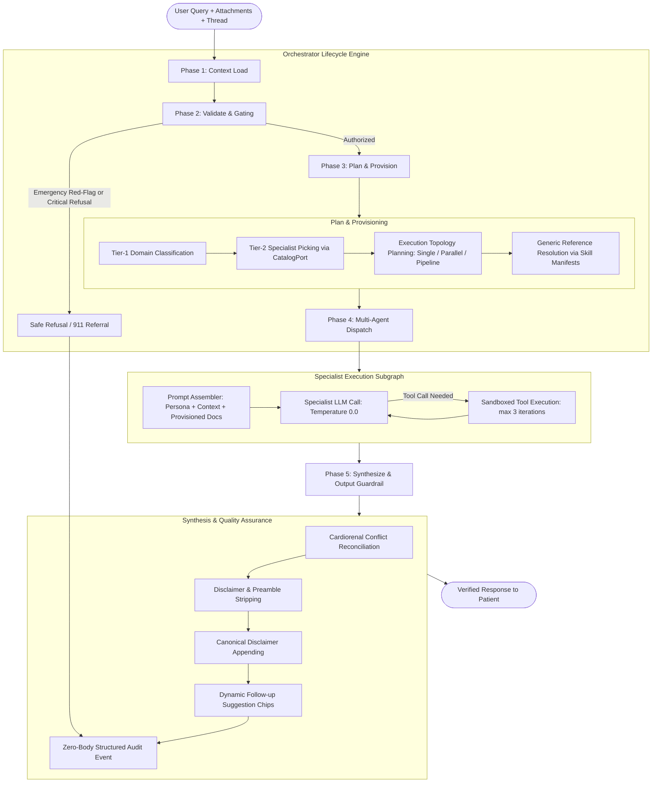
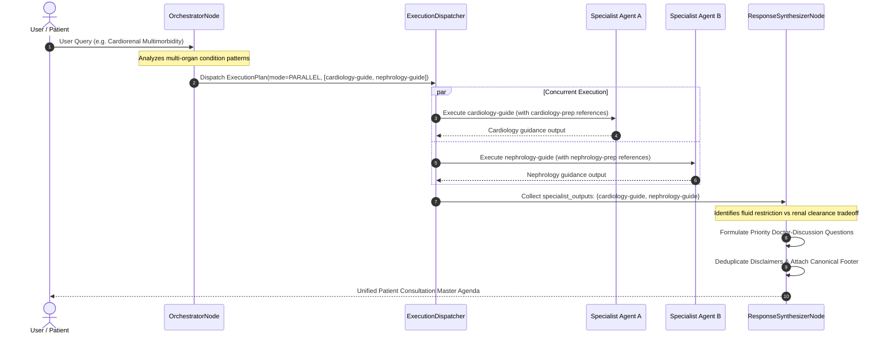

# Orchestrator Engine & Multi-Agent Lifecycle

The Carefold Orchestrator is the central conductor of the multi-agent runtime. It coordinates context loading, clinical safety gating, intelligent two-hop agent routing, dynamic skill and reference provisioning, execution dispatching across single/parallel/pipeline topologies, and response synthesis.

---

## Design Vision & Persona Purity

A primary architectural achievement of Carefold is the strict separation between **Specialist Domain Knowledge** and **Operational Workflow Plumbing**:

1. **Specialist Agents are Pure Clinicians/Stewards**: Their personas (`persona.md`) define healthcare domain expertise, empathetic bedside manner, systematic interview protocols, and emergency awareness. They are completely decoupled from filesystem paths, tool invocation syntax, and document filenames.
2. **The Orchestrator is the Conductor**: The orchestrator handles intent parsing, catalog search, document preflighting, dependency sequencing, and multi-agent synthesis.
3. **Dynamic Reference Provisioning**: Instead of hardcoding document names into agent instructions, the orchestrator inspects declared skills on `AgentManifest.skills`, queries `SkillManifest.references`, and automatically injects matching clinical protocols directly into the agent's prompt context.

### Persona Purity Contract

| Content Type | Location | Allowed Content | Strictly Forbidden Content |
|---|---|---|---|
| **Agent Persona** | `agents/<id>/persona.md` | Clinical focus, empathy style, patient interview steps, organ-specific red flags | Filesystem paths, tool calling JSON syntax, hardcoded skill IDs, document filenames |
| **Agent Manifest** | `agents/<id>/agent.yaml` | ID, title, domain, category, risk class, care stages, declared skills, permitted tools | Inline execution code, routing logic, prompt templates |
| **Skill Definition** | `skills/<id>/SKILL.md` | Skill domain scope, 3 mandatory intended-use lines, instructions | Agent routing logic, orchestrator control loops |
| **Skill References** | `skills/<id>/references/*.md`| Clinical agendas, logging forms, decision checklists, criteria tables | Executable code, tool commands |
| **Orchestrator** | `carefold.workflows.nodes.orchestrator_node` | Two-hop routing, manifest resolution, generic provisioning, dispatching | Hardcoded specialty branching (no `elif "cardiology-prep" in ...`) |

---

## The 5-Phase Orchestrator Lifecycle

The end-to-end lifecycle follows five discrete, verifiable phases:

$$\text{Phase 1: Context Load} \longrightarrow \text{Phase 2: Validate and Gate} \longrightarrow \text{Phase 3: Plan and Provision} \longrightarrow \text{Phase 4: Multi-Agent Dispatch} \longrightarrow \text{Phase 5: Synthesize and Guard}$$

---

## Phase Breakdown

### Phase 1: Context Load
- **Implementation**: `backend/src/carefold/loaders/context_loader.py` (`ContextLoader.load_context`).
- **State Fields Populated**: `state["attachments"]`, `state["notes"]`, `state["catalog_summary"]`.
- **Operations**:
  - Ingests user attachments from `attachments/`, rejecting path traversal (`..`) and invalid extensions.
  - Loads notes from `workspace/notes/*.md` or `notes/*.md`, extracting titles and preview snippets.
  - Retrieves catalog summaries of indexed agents from SQLite FTS5 via `CatalogPort`.

### Phase 2: Validate & Safety Gating
- **Implementation**: `backend/src/carefold/safety/emergency.py` and `backend/src/carefold/safety/classifier.py`.
- **Operations**:
  1. **Emergency Red-Flag Scan**: Scans user query against regex patterns for acute cardiac pain (`CHEST_PATTERNS`), stroke FAST symptoms (`STROKE_PATTERNS`), and anaphylaxis/airway compromise (`ANAPHYLAXIS_PATTERNS`). If triggered, execution halts immediately with a directive to contact 911 or visit an emergency room.
  2. **Non-Clinical Refusal Gate**: Evaluates input against forbidden non-clinical behaviors: diagnosis, prescription/dosing, emergency diversion, or medication cessation.
  3. **Risk-Class Consent Check**: Verifies that `state["allow_clinical"]` is enabled if a `clinical_assist` risk-class agent is required.

### Phase 3: Plan & Generic Provisioning
- **Implementation**: `backend/src/carefold/workflows/nodes/orchestrator_node.py` (`OrchestratorNode`).
- **Two-Hop Routing**:
  - **Hop 1 (Tier-1 Domain Classification)**: Classifies user intent into a canonical domain (`clinical`, `therapy`, `wellness`, `navigation`, `education`) and category subpath (e.g., `clinical.cardiology`).
  - **Hop 2 (Tier-2 Specialist Picking)**: Executes FTS5 search on `CatalogPort` with a 4-step fallback hierarchy, selecting the optimal specialist manifest.
- **Generic Reference Provisioning**:
  - Inspects `AgentManifest.skills` for the chosen specialist.
  - Matches prompt tokens against `SkillManifest.references`.
  - Reads matching markdown references from disk (or synthesizes them via `SkillGeneratorNode` if missing) and stores them in `state["provisioned_references"]`.
- **Topology Selection**:
  - Decides whether execution requires `Single`, `Parallel`, or `Pipeline` topology based on cross-functional keyword analysis and multimorbid symptoms.

### Phase 4: Multi-Agent Dispatch
- **Implementation**: `backend/src/carefold/workflows/dispatcher.py` (`ExecutionDispatcher`).
- Coordinates execution according to the selected `ExecutionMode`:

#### Execution Topologies:
1. **Single Topology**: Direct fast-path execution of a single specialist via `AgentExecutionNode`.
2. **Parallel Topology**: Concurrent fan-out via `asyncio.gather`. Used when a patient presents symptoms across multiple organ systems (e.g., hypertension + chronic kidney disease).
3. **Pipeline Topology**: Chained sequential execution using topological sort (`_topological_sort_tasks`). Upstream specialist outputs are formatted and injected into downstream specialist prompts under `# PRIOR SPECIALIST OUTPUTS` (e.g., clinical diagnosis review by `cardiology-guide` forwarded to `prior-auth-navigator`).

### Phase 5: Response Synthesis & Output Guardrail
- **Implementation**: `backend/src/carefold/workflows/nodes/response_synthesizer_node.py` (`ResponseSynthesizerNode`).
- **Operations**:
  1. **Cardiorenal Conflict Reconciliation**: When outputs involve both cardiology and nephrology and mention fluid or sodium, automatically reconciles potential fluid restriction vs. renal clearance conflicts into collaborative doctor-discussion questions.
  2. **Disclaimer Deduplication**: Strips individual agent disclaimers and robotic preambles (`"Based on the provided reference document..."`).
  3. **Canonical Disclaimer Appending**: Appends the single, standardized disclaimer:
     > *"DISCLAIMER: Carefold is an educational and administrative navigation companion, not a licensed healthcare provider. Do not alter prescription medications or therapy plans without consulting your physician."*
  4. **Dynamic Suggestions**: Generates 2–3 contextual next-step question chips for the user interface.
  5. **Zero-Body Audit Event**: Writes an immutable audit entry to `logs/audit.jsonl` recording the execution metadata with prompt/body redaction.
