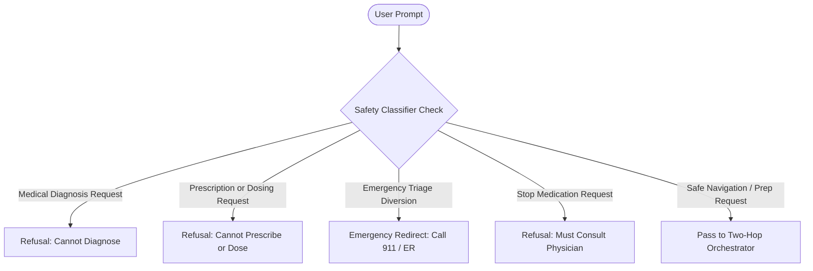

# Clinical Safety Boundaries & Guardrails

Carefold enforces strict safety guardrails to ensure that AI agents never exceed their intended non-clinical navigation boundaries or cause patient harm.

---

## Clinical Risk Classes

Every agent manifest declares a `risk_class` (`RiskClass` enum in `backend/src/carefold/schemas/manifest.py`):

| Risk Class | Permitted Activities | Consent Required? | Example Agents |
|---|---|---|---|
| **`wellness`** | Habit tracking, lifestyle support, hydration. | No | `habit-companion` |
| **`admin`** | Prior auth checklists, insurance appeals, formulary navigation, record indexing. | No | `benefits-guide`, `claims-appeals-guide`, `formulary-guide`, `prior-auth-navigator`, `records-coordinator` |
| **`education`** | Explaining medical terms, anatomical concepts, procedure overviews. | No | `_template` (community educational agents) |
| **`clinical_assist`** | Organ-specific symptom tracking, specialist appointment agendas, question formulation. | **Yes** (`allow_clinical=True`) | `visit-steward`, `cardiology-guide`, `neurology-guide`, and the other specialist navigators |

### Clinical Consent Gate
When an agent is configured with `risk_class: clinical_assist`, the backend refuses to return its detail (`GET /api/agents/{id}` → `403`) or execute it (`POST /api/chat`) unless the request carries `allow_clinical=true`. Neither the backend nor the Next.js proxy routes ever assume consent: an absent or non-`true` value is treated as `false`.

In the web client, consent is an explicit, per-agent user decision:

- The first time a user opens chat with a `clinical_assist` agent, a consent dialog explains what the agent can help with, what it will not do (the agent's `forbidden` list in plain language), and emergency guidance (911 / 988). The user must tick an acknowledgement before continuing; closing the dialog or pressing Escape declines.
- Consent is stored only in the browser under `localStorage["carefold_clinical_consent_v1"]` as `{ "<agent-id>": { "grantedAt": "<ISO 8601>" } }`. It is read at request time, so `allow_clinical` reflects the stored decision on every call.
- Without consent, chat is disabled with an explanation, and the agent detail page shows a read-only summary (the persona is withheld).
- A "Clinical assist: consent given" chip appears in the chat header. Consent can be withdrawn per agent, or for all agents, under **Settings → Clinical Assist Consent**; withdrawal applies to the next request.

`wellness`, `admin`, and `education` agents are never gated.

---

## Non-Clinical Refusal Boundaries

Carefold's safety classifier (`backend/src/carefold/safety/classifier.py`) evaluates every user prompt against four forbidden clinical actions:



### 1. Medical Diagnosis (`DIAGNOSIS`)
- **Prohibition**: Agents must never confirm, diagnose, or assert that a patient has a specific medical condition.
- **Enforcement**: If a prompt asks *"Do I have heart failure?"*, the agent explains what heart failure is educationally and helps the user prepare a list of specific questions to ask their cardiologist.

### 2. Dosing & Prescribing (`DOSING_PRESCRIBING`)
- **Prohibition**: Agents must never suggest starting prescription drugs or calculate milligram dosages, titration schedules, or timing.
- **Enforcement**: Prompts asking *"How many milligrams of lisinopril should I take?"* are immediately refused with guidance to consult the prescribing clinician or pharmacist.

### 3. Emergency Triage Diversion (`EMERGENCY_TRIAGE`)
- **Prohibition**: Agents must never attempt to manage, treat, or delay care for acute, life-threatening symptoms.
- **Enforcement**: Prompts mentioning acute chest pain, stroke symptoms, or anaphylaxis trigger immediate emergency referral.

### 4. Medication Discontinuation (`MEDICATION_DISCONTINUATION`)
- **Prohibition**: Agents must never advise a patient to discontinue, reduce, or skip doctor-prescribed medications.
- **Enforcement**: Prompts asking *"Should I stop my blood thinners?"* are refused, directing the patient to discuss any side effects directly with their doctor.

---

## Canonical Legal Disclaimer

To eliminate repetitive, robotic disclaimers from constituent agents, `ResponseSynthesizerNode` strips constituent disclaimers and appends a single canonical disclaimer footer to every synthesized response:

```
DISCLAIMER: Carefold is an educational and administrative navigation companion, not a licensed healthcare provider. Do not alter prescription medications or therapy plans without consulting your physician.
```

---

## Zero-Body Audit Logging & PHI Redaction

Carefold writes structured audit events to `logs/audit.jsonl` upon every synthesis and gating event.

By default (`CAREFOLD_AUDIT_STORE_BODIES=false`), the audit logger invokes `redact_audit_event`:
- Patient prompt text is **redacted**.
- Model completion text is **redacted**.
- Execution metadata (timestamp, agent ID, allowed status, target agents, thread ID) is **preserved**.

This preserves traceability of agent decisions while keeping prompt and completion text, which may contain Protected Health Information (PHI), out of the audit log by default. It is designed to support privacy reviews and does not by itself constitute regulatory compliance or certification.
